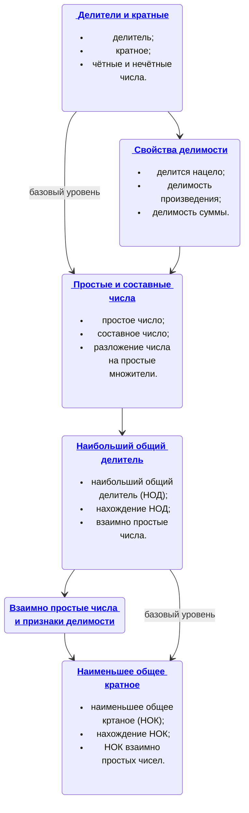

---
В этом разделе вы познакомитесь с важными математическими понятиями, которые помогут вам лучше понимать деление чисел.

#### Что вы узнаете:

- Как находить делители и кратные чисел.
- Основные свойства делимости.

#### Почему это важно:

- Эти знания необходимы для успешного освоения школьной математики.
- Они особенно важны для решения задач повышенной сложности, таких как задание №19 на ЕГЭ.
- Понимание темы поможет вам успешно участвовать в математических олимпиадах. 🏆

#### Как это поможет вам:

- Изученные понятия станут прочной базой для решения сложных задач.
- Вы будете лучше подготовлены к экзаменам  по математике. ✏️
- Вы сможете быстрее и рациональнее выполнять вычисления.

---

1. [Делители и кратные](/docs/deliteli-i-kratnye)➗

**Теория:** Узнаем, что такое делитель и кратное числа, и как определять их для различных чисел.

**Практика:** Задания помогут вам научиться находить делители и кратные чисел, что пригодится в дальнейших разделах математики. 

2. [Свойства делимости чисел](/docs/svojstva-delimosti-chisel) 🔢

**Теория:** Рассмотрим основные свойства делимости, которые помогают быстро и эффективно находить делители и кратные.

**Практика:** Закрепим эти свойства на примерах. 

3. [Простые и составные числа](/docs/prostye-i-sostavnye-chisla) 🟢🔴

**Теория:** Разберем, какие числа называются простыми, а какие составными, и как их различать.

**Практика:** Применим знания на уроках и в домашних заданиях для решения задач. 

4. [Наибольший общий делитель](/docs/naibolshij-obshchij-delitel) 🧩

**Практика:** Научимся находить НОД чисел, что важно для решения задач, где требуется найти общие делители. 

5. [Наименьшее общее кратное](/docs/naimenshee-obshchee-kratnoe) 🔄

**Практика:** Узнаем, как находить НОК чисел, что пригодится при решении задач на совместные действия с несколькими числами. 

Эти темы являются основой школьной математики и помогут вам лучше понимать и решать математические задачи, а также подготовиться к дальнейшему изучению более сложных тем. 🌟

---

### Дорожная карта темы "Делимость натуральных чисел"

